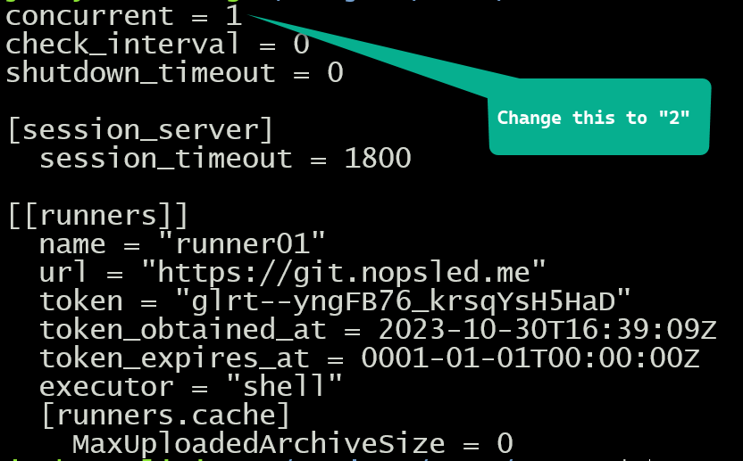

# Malware As A Service (MAAS)

## Getting started

In todays modern defense stack environment, penetration testers are faced with significant obstacles for initial access operations. There are many technologies deployed in environments design to thwart attempts at executing various binary artifacts on an endpoint and prevent initial access from succeeding.

Having said this, the best approach to tackling a good defense is to come prepared with a better offense!  This project describes a DevOps approach I have named "**Malware As A Service**" which leverages the CI/CD capabilities of the community gitlab software to build a malware artifact generation pipeline.

Here at Black Hills Information Security, after presenting this concept at Wild West Hackin' Fest, I believe that the work presented here makes me the unofficial "**father of malware as a service**", and that other penetration testing companies can benefit from this work.

## The Challenge

As penetration testers, we must produce unique, highly evasive and successful artifacts for initial access operations of Red Team and assumed compromise style engagements. In short, we are tasked with emulating real world threat actors and must use sophisticated malware techniques to be successful.

The MAAS approach allows us to address the significant challenges we face today which include the following:
* Not all penetration testers want to be developers.
* The quality of various Proof of Concept (POC) source code on the Internet varies widely, and in many cases is of low quality.
* Static artifact analysis as a first line of defense will defeat many compiled POC entities.
* Defense vendors leveraging Windows kernel callback notifications to dynamically respond to suspicious processes.
* Defense vendors now employing sophisticated analysis techniques including but not limited to:
    * Subscribing to Event Tracing for Windows
    * Memory page scanning
    * Stack call back tracing and analysis
    * Process tree analysis
    * Windows DLL API hooking
    * Kernel driver block listing
    * Artifical intelligence approachs to dynamically profile malware behavior.
* There are a number of developers who provide malware frameworks out there but there is a tendency to use default switches, and not customize to fit a target customer profile.

## Steps to create your own Malware As A Service (MAAS) Offering

The CI/CD approach allows us to define a pipeline of operations which in a software development context is normally focused on some form of unit tests in support of security scanning, quality assurance, and robust regession testing.

With **MAAS**, we will take a different approach whereby each of the pipeline stages are dedicated to the production of malware artifacts. The input data needed for the generation of malware artifacts can be in the form of various configurable switches, some shellcode if needed, and other items such as callback URLs for example. 

In our development, and since the GitLab CI/CD approach is YAML centric, we decided to use static YAML files for malware configuration, initial CI/CD operations, and then further Python scripts which drive dynamic child stages of the pipeline by also producing YAML artifacts.

As the methodology developed, the following stages of processing were defined:
1. Initial Preparations
2. Malware Compilation / Production
3. Data Consolidation and Child Pipeline YAML Generation
4. Dynamic Child Pipeline Execution
5. Malware Artifact Post Processing
6. Cleanup and Statistical Data Collection

It is important to note the following:
* A global **config.yml** file is used throughout these pipeline stages which will determine the behavior of the pipeline as it executes.
* At any stage of CI/CD pipeline execution, there can and will exist parallel jobs assuming that no co-dependency exists between jobs.
* Multiple gitlab runners can be used to service the CI/CD jobs assuming that shared storage is deployed such that post processing jobs have a view of all generated artifacts.
* Any single gitlab runner can be deployed native to the operating system itself, or even within a Docker container.
* To achieve your goals, it is likely that you will require different deployed O/S platforms as gitlab runners servicing the CI/CD jobs.

## Pre-Requisites

In order to use this sample repository and documentation there are some infrastructure pre-requisites:

* A fully installed Gitlab server with DNS domain and properly configured TLS certificate.
* A new project repository with the CI/CD feature enabled in the repository settings.
* A Linux server with docker installed and network reachability to the Gitlab server. I prefer Ubuntu for my distribution choice.
    * Note: Please review this docker document at https://docs.docker.com/engine/install/ubuntu/ 

## What is a GitLab Runner?

 A gitlab runner is a software agent installed on a different server from the GitLab server. The GitLab Runner receives instructions from the GitLab server in regards to which jobs to run. Each deployed runner must be registered with the GitLab server.

 A gitlab runner will use a **runner executor** which is essentially the environment within which a gitlab job is executed.  There are a number of different executors you can choose including but not limited to:
 * Shell
 * PowerShell
 * Docker
 * Virtual Box

In our **MAAS** architecture, we choose the shell environment for runner execution. On a Linux operating system, this is **/bin/bash** whereas in a Windows environment, this is **PowerShell**. Depending on the skillset of the person maintaining the CI/CD yaml files, and also since **PowerShell** is now open source, it is possible to choose a unified shell across platforms, that being **pwsh** (PowerShell).

During development, we decided that using a combination of **SMB/CIFS** shared storage provided by **Network Attached Storage (NAS)** as well as using docker volumes, and *docker stack* provided a nice balance of just big enough without having to move to a full **Kubernetes** and *docker swarm* approach.

Depending on the desired scale and diversity of malware artifact generation, others may choose to avoid the complexity of docker and just stay with a basic shared storage approach across runners.

## Detailed Configuration Recipe/Steps

IMPORTANT: All of the documented steps listed below have already been completed, and the results of that work is mostly contained within the **runner** directory of this repository. You can of course attempt to replicate the steps, but my intent is for you to take the existing skeleton that has been built here and enhance further for your own purposes.

1. [Creating a Gitlab Runner in a Docker Container](docs/01-runner.md)
2. [Configuring Four Unique Gitlab Runners](docs/02-runner.md)
3. [Creating a Docker Stack for Deployment](docs/03-docker-stack.md)
4. [Adding ScareCrow to the Docker Container](docs/04-scarecrow.md)
5. [Your First CI/CD Pipeline](docs/05-first-pipeline.md)

## MAAS Architecture Diagram

## Roadmap

* November 2023: Initial Draft Repo and Docs

## Contributing

Any and all ideas are welcome. 

## Authors and acknowledgment

Joff Thyer (c) 2023
Black Hills Information Security LLC

## License

This project is licensed with the MIT License.

## Project status

The project is under active development and maintenance as of November 2023.
