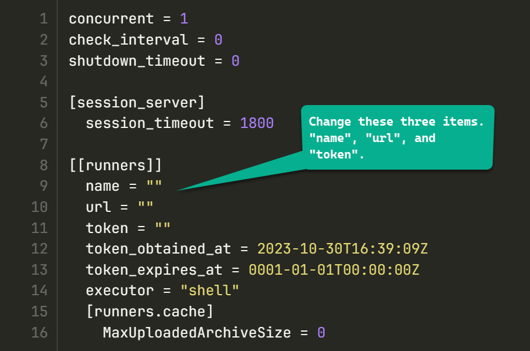

## Configuring Four Unique Gitlab Runners

Now we are going to use the **template.toml** file to create four different files in our **config_toml** directory.  Each of these configuration files will have identical configuration except the gitlab token used, and the **name** field.  In addition we will remove the **id** field in each configuration file.

The goal is to generate four unique configuration files to be used with four different running containers.

1. Goto the GitLab repo CI/CD settings by selecting Settings->CICD->Runners.
2. Click on **New Project Runner** to create a new gitlab runner.
    * select Linux as the operating system
    * type in a TAG named "**maas**"
    * Do NOT select the **run untagged jobs** checkbox.
    * click on **Create Runner**
    * copy the GitLab Token and save it to a file.
3. Repeat the above steps four times, saving the new token to your file each time.

### Editing the TOML configuration files

1. In your **config_toml** directory, create four different files by copying the **template.toml** file to **1.toml**, **2.toml**, **3.toml**, and **4.toml**.
2. Use your favorite text editor to remove the **Id** field, and ensure that both the **name** and the **token** fields are blank.
3. Edit each of the four files in turn, placing a unique Gitlab token into each file, and naming them **runner01**, **runner02**, and so forth in that **name** field. Check and ensure that the **URL** field contains the correct fully qualified domain name of your GitLab server.

When you have completed this task, each **toml** configuration file will have a unique Gitlab token, unique name, and the same Gitlab server URL contained within it. Below is an example of what my **1.toml** file looks like.

[Goto Next Document -->](docs/03-runner.md)
