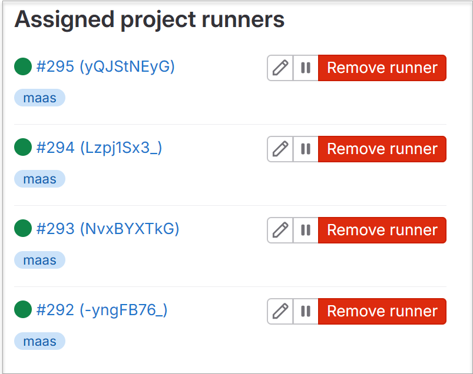

## Creating a Docker Stack for Deployment

At this point in time, you should have the correct runner names and tokens saved in files **1.toml**, **2.toml**, **3.toml**, and **4.toml**.  These four files will be used by the gitlab runner inside of the docker container when we stack up the entire configuration using a **docker stack**.

### Background Information

**Docker Compose** was the first tool that was created to solve the challenge of orchestrating multiple containers. In our architecture we are going to be creating individual containers as docker services, and will also be required to orchestrate these containers using docker compose.

**Docker Compose** did not used to be included in the standard Docker installation but now since docker extended capabilities with docker stack, compose is builtin.   Here are some important reference links:

* https://docs.docker.com/compose/install/linux/
* https://docs.docker.com/engine/swarm/swarm-tutorial/
* https://medium.com/leniolabs/docker-definitions-example-and-docker-compose-3bf77c58166f

A **Docker Service** is the definition of a docker image with some additional configuration that allows it to work in the context of a larger application. A **service** will likely have many tasks with an associated container created from the same docker image. For our use case, we want to replicate the same malware compilation service a number of times in order to provide some parallel capacity to execute the CI/CD jobs.

A **Docker Stack** is used to manage the orchestration of multiple containers, and when combined with a docker swarm this extends across multiple machines. We are going to use a simplified version of a docker stack which in essence contains only a single service.  Even with this simple stack, we will need to initialize a docker swarm with our server as the *docker swarm* manager.

If you have multiple servers available to you, you will be required to use a shared storage mechanism so that the docker volumes are visible to more than one host machine.  In a two host/server situation, you would also need to configure one host as a **swarm manager** and the second host as a **swarm worker**. 

### Step 0: Some Prerequisits

#### Configuring the Docker Swarm

Before you can deploy a docker stack, you must initialize the docker swarm.

1. For a single docker server, use the following command to initialize the docker swarm:

```
$ docker swarm init
```

2. For two or more servers, you can initialize the swarm as follows:

* Choose one server to be the master node, and initialize with this command. We are making the assumption that the ethernet interface on this server has address of 10.10.10.10.

```
$ docker swarm init --advertise-addr 10.10.10.10                                                    
Swarm initialized: current node (mxk3nfpql3kv3cb6eca2to514) is now a manager.                                            
                      
To add a worker to this swarm, run the following command:                                                                

    docker swarm join --token SWMTKN-1-0yx6zht222xc35cbwvo28ny3oq8bx3nbb2h7lvsmzy7hll01x2-e81c88xpkhclyqmyvq9a3mcwi 10.10.10.10:2377

To add a manager to this swarm, run 'docker swarm join-token manager' and follow the instructions.
```

* On each of the other hosts/servers you will need to use the **JOIN** command as listed in the output above.


### Step 1: Edit the Dockerfile.template, save and build the new container

Our new Dockerfile will be saved to **Dockerfile.DRAFT1** and contains these required additional steps.

* Add a new user called "runner" with the *useradd* command.
* Make a working directory called **/runner**.
* Change ownership of the **/runner** directory to "**runner:runner**" using chown.
* Uninstall/reinstall gitlab-runner within the container
* Set the working directory to **/runner**
* Copy all of the "**config_toml**" directory to the container **/runner** directory
* Execute the gitlab-runner as the final step of the container launch.

We take advantage of a special variable called **$TASK_SLOT** when we launch the gitlab-runner in the container which enables us to pick up a unique *.tomL* configuration file for each of the four launched containers.

Listed below is our modified **Dockerfile.DRAFT1** file which accomplishes all of the above steps.

```
FROM ubuntu:latest
RUN apt-get -qqy update
RUN apt-get install -y apt-utils
RUN apt-get install -y curl
RUN curl -L "https://packages.gitlab.com/install/repositories/runner/gitlab-runner/script.deb.sh" -o runner-script.sh
RUN chmod 755 ./runner-script.sh && ./runner-script.sh
RUN rm -f runner-script.sh
RUN apt-get install -y gitlab-runner
RUN useradd runner
RUN mkdir /runner
RUN chown -R runner:runner /runner
RUN gitlab-runner uninstall
RUN gitlab-runner install -user runner
WORKDIR /runner
COPY config_toml /runner/config_toml
CMD gitlab-runner run --working-directory /runner --config /runner/config_toml $TASK_SLOT.toml --user runner
```

### Step 2: Rebuild the **maas** docker container

When building a container from a file named anything other than **Dockfile**, you will need to specify some additional syntax to the **docker build** command. After using your favorite search engine, you might be tempted to execute a command like this: "**docker build -t maas - <Dockerfile.DRAFT1**".  

**DONT DO THIS** or you will become eternally frustrated that the build will break.

Use the syntax specified below to build the docker container.  The **-f** flag to specify the correct Dockerfile is critically important.  

```
$ docker build -t maas -f Dockerfile.DRAFT1 .

[+] Building 0.1s (20/20) FINISHED
 => [internal] load .dockerignore
 => => transferring context: 2B
 => [internal] load build definition from Dockerfile.DRAFT1
 => => transferring dockerfile: 698B
 => [internal] load metadata for docker.io/library/ubuntu:latest
 => [internal] load build context
 => => transferring context: 230B
 => [ 1/15] FROM docker.io/library/ubuntu:latest
 => CACHED [ 2/15] RUN apt-get -qqy update
 => CACHED [ 3/15] RUN apt-get install -y apt-utils
 => CACHED [ 4/15] RUN apt-get install -y curl
 => CACHED [ 5/15] RUN curl -L "https://packages.gitlab.com/install/repositories/runner/gitlab-r
 => CACHED [ 6/15] RUN chmod 755 ./runner-script.sh && ./runner-script.sh
 => CACHED [ 7/15] RUN rm -f runner-script.sh
 => CACHED [ 8/15] RUN apt-get install -y gitlab-runner
 => CACHED [ 9/15] RUN useradd runner
 => CACHED [10/15] RUN mkdir /runner
 => CACHED [11/15] RUN chown -R runner:runner /runner
 => CACHED [12/15] RUN gitlab-runner uninstall
 => CACHED [13/15] RUN gitlab-runner install -user runner
 => CACHED [14/15] WORKDIR /runner
 => CACHED [15/15] COPY config_toml /runner/config_toml
 => exporting to image
 => => exporting layers
 => => writing image sha256:ce205d683d10544ac9be2ad085a022f755bce4733ac0ee5b4cdd65871d213ebe
 => => naming to docker.io/library/maas

```

### Step 3: Create/review the **docker-compose.yml** file.

Before we deploy a docker stack, we need a common docker volume for file storage, and we need an appropriately formatted **docker-compose.yml** file which will be used to configure our stack.

The docker volume will be specified in our docker-compose file. It will be created when the docker stack is deployed.

Fortunately for you, I have done the legwork required to build a docker compose file which will run your 4 different containers as a docker service with a common docker volume.  Listed below is the **docker-compose.yml** file we will be using. Notably we will be relying on that **$TASK_SLOT** environment variable that the docker stack deployment command will set for us.

```
version: "3"

volumes:
  payloads:

services:
  maas:
    build:
      context: .
    image: maas:latest
    restart: always
    volumes:
        - payloads:/payloads
    environment:
        TASK_SLOT: "{{.Task.Slot}}"
    deploy:
        mode: replicated
        replicas: 4
```

### Step 4: Deploy the Docker stack.

Now we will use the **docker stack** command to read the docker compose file and deploy a docker service stack of our four containers. Make sure you are in the **runner** directory of this repo, and execute the following command.

```
$ docker stack deploy -c docker-compose.yml maas

Ignoring unsupported options: build, restart
Creating network maas_default
Creating service maas_maas
```

Assuming that everything checks out, you can now use the **docker ps** command to check the container status.

```
$ docker ps
CONTAINER ID   IMAGE         COMMAND                  CREATED          STATUS          PORTS     NAMES
26e79e7feaad   maas:latest   "/bin/sh -c 'gitlab-…"   24 seconds ago   Up 22 seconds             maas_maas.3.vejolf8miitxr4ettv9d0c51c
88419ba33a35   maas:latest   "/bin/sh -c 'gitlab-…"   24 seconds ago   Up 22 seconds             maas_maas.4.txhozi2dqxilh0fe49x28lpn2
7c37dd4ab8e8   maas:latest   "/bin/sh -c 'gitlab-…"   24 seconds ago   Up 22 seconds             maas_maas.2.p1gvuco8816a6rcfyh00xzcpz
548ea98dc949   maas:latest   "/bin/sh -c 'gitlab-…"   24 seconds ago   Up 22 seconds             maas_maas.1.uwo3zh4oah19o1e715sjxunn6
```

You can also list the common docker volume that has been configured as follows:

```
$ docker volume ls
DRIVER    VOLUME NAME
local     maas_payloads
```

You should verify on your GitLab community server that all the configured **maas** runners have a GREEN light showing to indicate the containers have indeed checked in with the server.



If at any point in time you wish to take the docker stack down / kill the containers, you can use the **docker stack rm** command as follows:

```
$ docker stack rm maas
Removing service maas_maas                                                                             Removing network maas_default      
```

### Important: Common View of Shared Storage

If you are deploying your docker service stack across more than one server host in a docker swarm, it is important that the commonly named docker volume is placed on shared storage.

In an Ubuntu Linux installation of Docker, the volumes created will be stored in the **/var/lib/docker/volumes** directory. If you anticipate that you will be creating a large amount of data, I would suggest either creating this as a separate mount point from the master server and exporting it across NFS, or using some form of Network Attached Storage (NAS).

I have used both approaches, and from my experience found that the NFS export from the master server, and then mounting that on the worker node(s) to be the simplest deployment option.  If you end up with shared storage, I found that a CIFS/SMB file system exported from the NAS works well especially if you anticipate configuring some native Windows server runners in the future.


## Congratulations!

You now have a running docker stack with four independant containers to service a CI/CD pipeline from your Gitlab repo.  Your docker stack is a simply Ubuntu distribution with no specific tools installed and no CI/CD pipeline steps configured to execute either.  The next document will further enhance the container with the installation of a malware generation tool and the configuration of the pipeline itself.


[Goto Next Document -->](./04-scarecrow.md)
