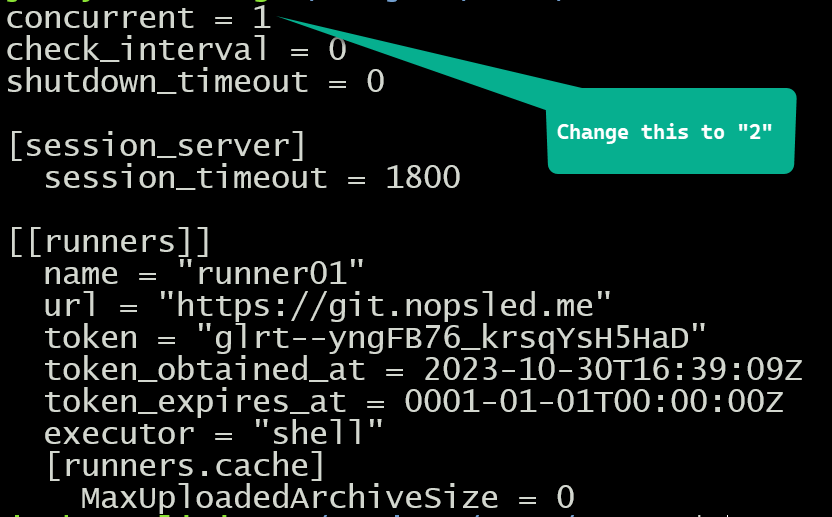

## Going Parallel

Because we have deployed multiple docker containers on our backend infrastructure,
we have the processing capability of executing pipeline jobs in parallel.
If the Gitlab configuration has different jobs listed in the same stage without any dependencies,
it will leverage concurrency to execute those jobs.

We have two different places in our architecture to take advantage of concurrency.
* First of all there is a concurrency setting in each gitlab runner **toml** configuration file.
* Secondly we can take advantage of the multiple containers that are deployed also.

For the sake of this exercise, we are going to follow these detailed steps.

1. Edit the **toml** configuration files and increased the concurrency setting to 2.
2. Redeploy the docker services to reflect the changes.
3. Edit the pipeline YAML file and configure four parallel jobs with a different ScareCrow malware command in each of the four jobs.
4. Execute the pipeline and observe the parallel jobs in action.

### Step 1: Changing the TOML configuration files

We already produced the TOML files to stand up our stack, so this step is as simple as editing each of the files and changing the concurreny option to 2.  Listed below is one of these files and as you can observe, it is very clear that concurrency is set to one and can be edited for our purposes.



We can proceed with editing each of the TOML files and updating this number. This has in fact already been completed for you.

### Step 2: Rebuild the Docker container and update the service

Thw following command will rebuild the container and update the Docker service. You will need to be in the **runner** directory before running these commands.  You will also need to be logged in to your master docker host if you have more than one Linux backend server in your docker swarm.

```
$ docker build -t maas -f Dockerfile.DRAFT2 .
<... output omitted ...>

$ docker service update --force maas_maas
maas_maas
overall progress: 4 out of 4 tasks
1/4: running   [==================================================>]
2/4: running   [==================================================>]
3/4: running   [==================================================>]
4/4: running   [==================================================>]

```

### Step 3: Edit the pipeline YAML and configure 4 parallel jobs

In this step we are going to modify the **BakingMalware** stage such that there is 4 ScareCrow jobs rather than just a single job.

IMPORTANT: If you are running multiple docker servers and a docker swarm, the file storage **MUST** be shared between the two hosts at this stage. If you do not have this capability, then you should drop back to using a single docker server on the backend configured as the docker swarm master.

Here is a listing of the relevant section of the modified "**.gitlab-ci.yml**" file.

```
ScareCrow01:
    stage: BakeMalware
    tags:
        - maas
    script:
        - |
            cd /payloads/${CI_COMMIT_SHORT_SHA}
            ScareCrow -I $CI_PROJECT_DIR/shellcode/shellcode_x64.bin -Loader dll -domain microsoft.com

ScareCrow02:
    stage: BakeMalware
    tags:
        - maas
    script:
        - |
            cd /payloads/${CI_COMMIT_SHORT_SHA}
            ScareCrow -I $CI_PROJECT_DIR/shellcode/shellcode_x64.bin -Loader binary -domain microsoft.com

ScareCrow03:
    stage: BakeMalware
    tags:
        - maas
    script:
        - |
            cd /payloads/${CI_COMMIT_SHORT_SHA}
            ScareCrow -I $CI_PROJECT_DIR/shellcode/shellcode_x64.bin -Loader control -domain microsoft.com

ScareCrow04:
    stage: BakeMalware
    tags:
        - maas
    script:
        - |
            cd /payloads/${CI_COMMIT_SHORT_SHA}
            ScareCrow -I $CI_PROJECT_DIR/shellcode/shellcode_x64.bin -Loader excel -domain microsoft.com

```

### Step 4: Execute the Pipeline and Observe

As we did earlier, trigger the pipeline using the Gitlab UI and observe the different parallel jobs that are running in the **BakingMalware** stage.  If you happen to make an error in your command line parameters to ScareCrow (which I did), you can click into the failed job and examine the output.


Output of the failed job is listed below.


[Goto Next Document -->](./07-dynamic-child-pipeline.md)
