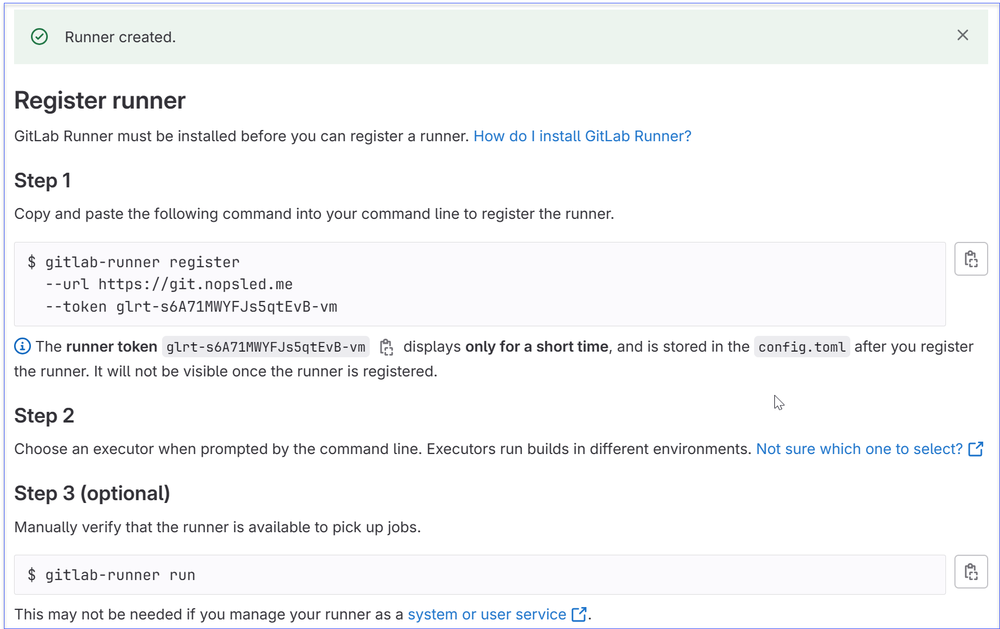

# Malware As A Service (MAAS)

## How to create a Gitlab Runner in a Docker Container

I found it very effective to execute GitLab runner inside a Docker container.
Having said this, one of the challenges to solve is that GitLab requires a unique token
per registered runner. Assuming that you will end up with multiple runners, it is
possible to register them in advance on the GitLab server and collect a file
of GitLab tokens.

After a runner is successfully registered, it will create a configuration file
which ends in a "**.toml**" extension. This file will contain the shell executor
configuration and gitlab token supplied by the gitlab server.

The steps to initially begin the runner configuration are as follows:
1. Build a Docker container with enough configuration such that the gitlab runner is installed.
2. Execute the container and manually register the runner with the intent of taking a copy of the "**.toml**" configuration file.
3. Extract the "**.toml**" configuration file and save to a file named "**1.toml**" outside of the Docker container.

I like to build my docker containers using Ubuntu. Listed below is a minimal docker file which
grabs a runner script from gitlab.com, executes it and then follows up with a package
installation of the gitlab-runner. Note: the *runner-script.sh* file is designed to add the appropriate
app package sources so that the subsequent *apt-get install* will work correctly. 

```
FROM ubuntu:latest
RUN apt-get -qqy update
RUN apt-get install -y apt-utils
RUN apt-get install -y curl
RUN curl -L "https://packages.gitlab.com/install/repositories/runner/gitlab-runner/script.deb.sh" -o runner-script.sh
RUN chmod 755 ./runner-script.sh && ./runner-script.sh
RUN apt-get install -y gitlab-runner
CMD /bin/bash
```

### Installing and registering the first GitLab runner

The goal of installing and registering the first runner is to collect a sample
**config.toml** file which can then be used for all other runners you wish to
configure in your pipeline.

Important: You must have an installed gitlab community server with it's own TLS certificate which is up and running before proceeding with these steps.

The steps are as follows:

1. Build your docker container.  The sample Dockerfile is contained within the *runners* directory of this repo.

```
cd runner
docker build -t maas .
```
*lots of output omitted*

2. Execute your docker container in iteractive mode as follows:

```
docker run -it maas
```

3. Register a new runner in your new GitLab repo project by selecting Settings->CICD->Runners, and clicking on "**New Project Runner**". You should see a screen that looks like this.



4. Within the bash shell of the runner, create a non-privileged username called **runner** and then use the following command:


```
root@4d4005ecaacc:/# gitlab-runner register

    Runtime platform arch=amd64 os=linux pid=14 revision=853330f9 version=16.5.0
    Running in system-mode.
    Created missing unique system ID                    system_id=r_3t1CVObvTsta

    Enter the GitLab instance URL (for example, https://gitlab.com/):
    https://git.server.tld

    Enter the registration token:
    glrt-mDvjxxxxxxxxxxxxx

    Verifying runner... is valid   runner=mDvjen4tZ
    Enter a name for the runner. This is stored only in the local config.toml file:  [4d4005ecaacc]:
    
    Enter an executor: docker+machine, instance, custom, docker, docker-windows, parallels, virtualbox, docker-autoscaler, kubernetes, shell, ssh: 
    shell
    
    Runner registered successfully. Feel free to start it, but if it's running already the config should be automatically reloaded!
    Configuration (with the authentication token) was saved in "/etc/gitlab-runner/config.toml"                    

```

4. Capture a copy of the **config.toml** file just by using copy and paste. We are going to use this file as a template for all runners we register in our pipeline.

```
concurrent = 1
check_interval = 0
shutdown_timeout = 0

[session_server]
  session_timeout = 1800

[[runners]]
  name = "4d4005exxxxxx"
  url = "https://git.server.tld"
  id = 291
  token = "glrt-mDvjen4tZBz3JzkMrrCB"
  token_obtained_at = 2023-10-30T16:39:09Z
  token_expires_at = 0001-01-01T00:00:00Z
  executor = "shell"
  [runners.cache]
    MaxUploadedArchiveSize = 0

```

### Save the config.toml file as a template

The first running instance of your Docker container was 100% focused on just generating the initial configuration template.  You should do the following:

* Create a **toml_config** directory in your GitLab repo.
* Save the above file to a file named "**template.toml**" in your **toml_config** directory.

Our intention in the next steps is to modify the Dockerfile such that it is compatible with a **docker stack** and use **docker compose** features to enable the running of multiple docker containers as gitlab runners to service the CICD jobs.

